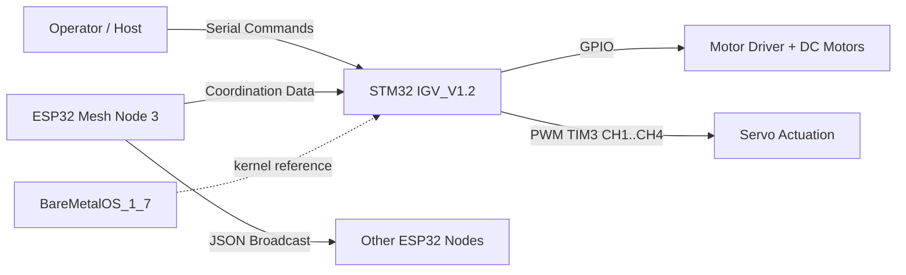

# Intelligent Guided Vehicle (IGV) on BareMetal OS

This repository contains embedded firmware for an agriculture-oriented Intelligent Guided Vehicle (IGV).  
The platform combines STM32 motor/servo control with ESP32 mesh coordination and a custom BareMetal OS scheduler.

## 1) Project Scope

The repository has three major codebases:

- `IGV_V1.2` - Main IGV firmware for `STM32F407` (CubeIDE project, motor + servo + UART command handling).
- `BareMetalOS_1_7` - BareMetal scheduler and synchronization testbed for `STM32F446`.
- `ESP32/Mesh_node3_V16` - ESP32 mesh control node (`.ino`) handling command broadcast, telemetry parsing, and auto-mode sequencing.

## 2) Core Capabilities

- BareMetal task scheduling (`BMOS_CreateTask`, `BMOS_StartScheduler`, `BMOS_Delay`).
- DC motor direction control through GPIO.
- 4-channel PWM steering/actuation through `TIM3`.
- UART command receive/transmit interrupt workflow on STM32.
- ESP32 mesh communication using JSON payloads.
- Auto coverage logic on ESP32 using configurable `Length`/`Width` and turn counting.

## 3) Hardware and Tools

### Hardware

- `STM32F407G-DISC1` (primary IGV control firmware).
- `STM32F446RE` board (BareMetalOS experiments/reference).
- ESP32 nodes (mesh network).
- Motor driver + DC motors + servo assemblies.
- Push buttons and status LED / NeoPixel.

### Software

- STM32CubeIDE (project import, build, flash, debug).
- ST-LINK (for STM32 debug/flash).
- Arduino IDE or compatible ESP32 toolchain.
- ESP32 libraries:
  - `painlessMesh`
  - `Arduino_JSON`
  - `Adafruit_NeoPixel`

## 4) High-Level Architecture



## 5) Repository Layout

```text
.
|-- README.md
|-- docs/
|   `-- media/README.md
|-- IGV_V1.2/
|   |-- Core/
|   |-- Drivers/
|   |-- Middlewares/          # includes FreeRTOS middleware tree
|   |-- Debug/                # generated build outputs
|   |-- IGV_V1.2.ioc
|   `-- IGV_V1.2 Debug.launch
|-- BareMetalOS_1_7/
|   |-- Src/
|   |-- Inc/
|   |-- Debug/
|   |-- V1_7.ioc
|   `-- V1_7.launch
|-- ESP32/
|   `-- Mesh_node3_V16/
|       `-- Mesh_node3_V16.ino
`-- Chip_headers/
```

## 6) Detailed Firmware Behavior

### `IGV_V1.2` (STM32F407 main firmware)

Boot sequence:

1. HAL initialization.
2. System clock setup.
3. GPIO init.
4. `TIM3` init + PWM start on 4 channels.
5. `USART2` init at `115200`.
6. UART RX interrupt start (3-byte command frame).
7. Create BMOS tasks and start scheduler.

Main tasks:

- `PulseLEDTask` - periodic heartbeat LED.
- `DCMotorTask` - maps `dcm_cmd` to motor GPIO direction pins.
- `LED4Task` - routes `MainCMD` into `dcm_cmd` or `srm_cmd`.
- `Servo1Task` - updates servo compare values and steering progression.

Interrupt callbacks:

- `HAL_UART_RxCpltCallback` - parses command and echoes response.
- `HAL_TIM_PeriodElapsedCallback` - tick maintenance (`TIM2`).

### `BareMetalOS_1_7` (kernel test project)

- Initializes UART and timer interrupt.
- Demonstrates thread creation (`osKernelAddThreads`, `osKernelAddThread`).
- Uses semaphores (`osSemaphoreInit`, `osSemaphoreWait`, `osSemaphoreSet`).
- Contains profiler counters for task behavior observation.

### `ESP32/Mesh_node3_V16`

- Initializes mesh and periodic broadcast task.
- Sends local status/command JSON to mesh.
- Parses remote telemetry fields (`ROBOT_ESP1_*`, `ROBOT_ESP2_*`).
- Supports manual commands and auto planner mode.
- Uses NeoPixel red/green to show network/activation state.

## 7) Command Mapping

### STM32 (`IGV_V1.2`)

- `MainCMD <= 20` -> treated as motor command (`dcm_cmd`).
- `20 <= MainCMD <= 35` -> treated as servo command (`srm_cmd`).

Observed motor examples:

- `dcm_cmd = 1` / `2` / `3` -> right front motor direction variants.
- `dcm_cmd = 4` / `5` / `6` -> right rear motor direction variants.

Observed servo example:

- `srm_cmd = 21..23` -> servo operation path in `Servo1Task`.

### ESP32 (`Mesh_node3_V16`)

- `0` -> reset/stop style command state.
- `1..8` -> direct turn-side command group (`Esp2TDcmd` path).
- `11..19` -> forward command group (`Esp1Fcmd = cmd - 10`).
- `21..29` -> turn command group (`Esp1Tcmd`, `Esp2Tcmd = cmd - 20`).
- `100..199` -> turn-count command (`Esp1TCntcmd = cmd - 100`).
- `200..999` -> forward-count command (`Esp1FCntcmd = cmd`).
- `1001..1999` -> set field length (`Length = cmd - 1000`).
- `2001..2999` -> set field width (`Width = cmd - 2000`).
- `5000` -> special state.
- `5001` -> auto mode operation.
- `5002` -> auto completion/termination state.

## 8) Build and Flash

### STM32 Projects (`IGV_V1.2`, `BareMetalOS_1_7`)

1. Open STM32CubeIDE.
2. Import both project directories as existing projects.
3. Select `Debug` configuration.
4. Build (`Project -> Build Project`).
5. Connect target board over ST-LINK.
6. Flash/debug using provided `.launch` files or `Debug As -> STM32 Cortex-M C/C++ Application`.

### ESP32 Project

1. Open `ESP32/Mesh_node3_V16/Mesh_node3_V16.ino` in Arduino IDE.
2. Install required libraries.
3. Select board and serial port.
4. Upload and monitor at `115200` baud.

## 9) Related Link

- BareMetal OS reference: [STM32-BareMetalOS-Crafting-from-Scratch](https://github.com/Omkar7637/STM32-BareMetalOS-Crafting-from-Scratch/blob/main/README.md)

## 10) License
